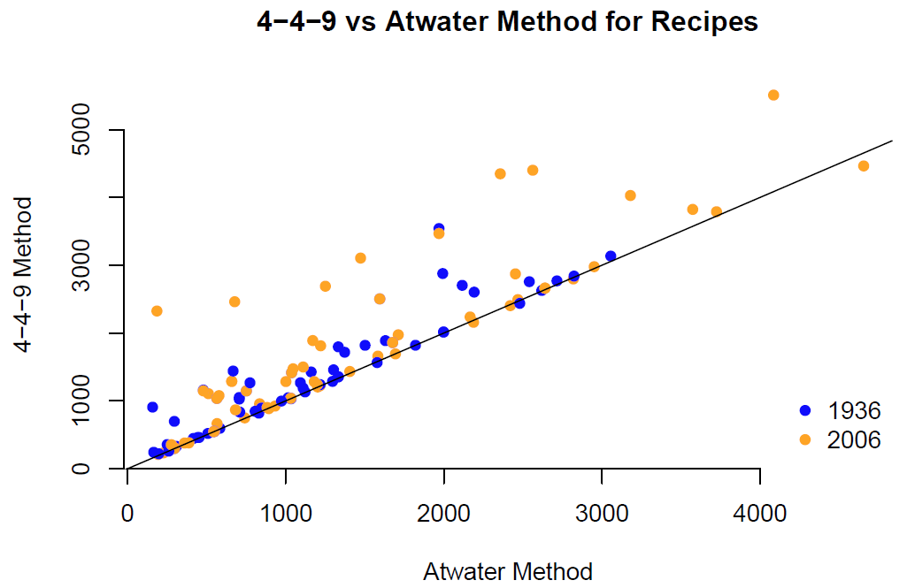
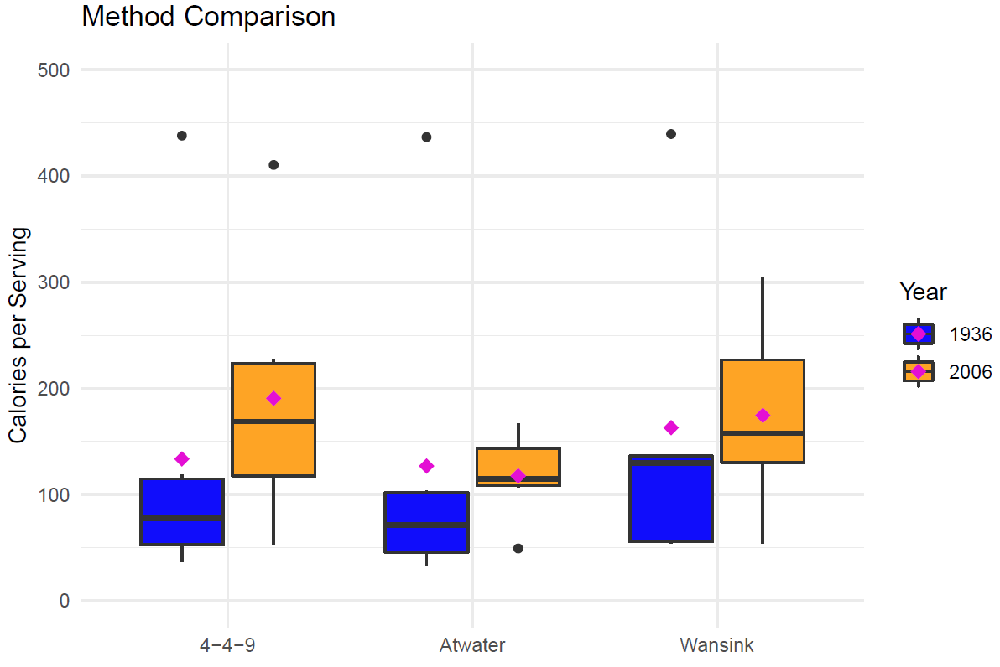

# JoyOfCooking

<b>Problem Introduction</b>

This was school project that consisted of two components. For the first part, each student was to create a single data table from individual recipe tables that come from the book <i>Joy of Cooking</i>. The individual recipe tables were created by other students in the class. Not all files followed specifications (ie, naming convention) and so the challenge was to work with the data while dropping as few recipes and ingredients as possible.

The second part of the project consisted of statistical analysis. I had chosen to compare two methods of calculating calories and  to determine if any bias exists in either method. Method 1 calculates calories using the 4-4-9 method which uses a factor of 4 for calories from carbohydrates (CHO), 4 for calories from proteins (PRO), and 9 for calories from fat (FAT)2. Method 2 uses the Atwater factors from the USDA database, which are known to be more accurate. 

<b>Programming Languages/Software:</b> R, RStudio  

<b>Skills Used:</b>  
Text Processing and Parsing  
Data Retrieval  
Data Wrangling  
Data Aggregation  
Statistical Analysis  

<b>Introduction</b>

The book <i>Joy of Cooking</i> is one of the most popular books in the United States. It has provided recipes for many American-favorite dishes since 1936. Each edition, eight in total, has seen recipes come and go, yet some recipes appear in each of the eight editions with minor changes, if any at all.

However, controversy brewed when in 2009, Brian Wansink of Cornell University published “The Joy of Cooking Too Much: 70 Years of Calorie Increases in Classic Recipes”. In this publication, the authors conclude that “calorie density and serving sizes in recipes from The Joy of Cooking have increased since 1936”. In 2018, this paper was retracted when an investigation found that academic misconduct had taken place.4

<b>Part I: Data Preprocessing and Retrieval</b>

Each student was to create tab delimited file with columns Amount, Measure, and Ingredient. Ingredient names were to match values from the USDA database (found on the <a href="https://data.nal.usda.gov/search/type/dataset" target="_blank">USDA National Agricultural Library website</a>) and an NDB_No from the USDA database was added to identify each ingredient. The recipe name and year was to be parsed from the file name. A <i>for-loop</i> was used to import the data from all the tab delimited files. 

Immediately, I noticed there were files that did not follow naming conventions, had different naming conventions for the required columns (ie, Unit rather than Measure), did not have the minimum columns of Amount, Measure, and Ingredient, had additional columns besides Amount, Measure, and Ingredient, did not include the NDB_No column, and some files were duplicates. As often as I could I leveraged the power and efficiency of R's vectorization ability. For example using the %in% operator, I was able to convert any nonconforming columns to specification. In addition, I retrieved NDB_No values from the USDA database using a custom function that matches the ingredient to that in the USDA database. Where matching NDB_No values were not found, I used another custom function to tokenize the Ingredient column and searched the USDA database for the closest match. There were three results in five occurrences that do not have equivalents in the USDA database table. These ingredients are dropped but not the recipe. A total of 1245 ingredients from 188 recipes were retrieved.

Entries in the Measure column also needed to be matched with the USDA database. A custom function was used to standardize and correct various Measure entries, such as “tbs” or “Tbsp” to “tbsp”.

I then searched the USDA table for Measure entries to return the matching Gm_Wgt value, which is used for the calorie conversion. The Amount column is multiplied by the Gm_Wgt column to get Grams for each ingredient entry. The Grams column was then multiplied by the nutrient content (a percent) to get grams of carbohydrate, protein, and fat. These weights were multiplied by the 4-4-9 or Atwater factor to convert to calories. All three are added to determine total calories of each ingredient, and all ingredient calories are added to determine calories of each recipe.

A note on missing values: Not all Measure entries matched the USDA database and there were 349 remaining NA values. Although this reduced the data by 28%, I dropped these entries due to time constraints. Furthemore, many of the Atwater factors is not provided in the USDA databasea nd NA values dropped to continue with analysis. A total of 687 ingredients and 122 recipes remain.

<b>Part II: Statistical Analysis</b>

I start by looking at the summary statistics for all four conditions by year.

#4-4-9 ingredient table 1936  
##Min. 1st Qu. Median Mean 3rd Qu. Max.  
##0.00 49.16 186.20 271.46 350.57 1738.30  

#Atwater ingredient table 1936  
##Min. 1st Qu. Median Mean 3rd Qu. Max.  
##1.05 70.69 199.48 282.60 374.06 1782.38  

#4-4-9 recipe table 1936  
##Min. 1st Qu. Median Mean 3rd Qu. Max.  
##221.0 836.3 1189.1 1375.1 1821.0 3541.5  

#Atwater recipe table 1936  
##Min. 1st Qu. Median Mean 3rd Qu. Max.  
##159.2 565.3 1034.6 1167.5 1595.3 3055.9  

#4-4-9 ingredient table 2006  
##Min. 1st Qu. Median Mean 3rd Qu. Max.  
##0.00 55.51 208.35 327.00 416.70 3681.13  

#Atwater ingredient table 2006  
##Min. 1st Qu. Median Mean 3rd Qu. Max.  
##1.05 53.60 203.58 306.75 407.15 3879.72  

#4-4-9 recipe table 2006  
##Min. 1st Qu. Median Mean 3rd Qu. Max.  
##211.6 958.2 1433.8 1828.0 2504.5 5508.0  

#Atwater recipe table 2006  
##Min. 1st Qu. Median Mean 3rd Qu. Max.  
##186.5 659.5 1171.6 1433.2 2166.6 4654.7  

<b>Findings:</b> Mean and quantile values between the ingredient tables (for both years) are fairly close to one another (5-10%
difference). Mean and quantile values between the recipe tables differ (for both years) 15-30% with 4-4-9 values being consistently higher.

A scatterplot confirms this second finding and shows that the 4-4-9 method scores many recipes with higher calorie content than the Atwater method. Interestingly, a majority of the recipes that display the increase are from 2006.

<b>Comparison with Wansink Data</b>

I subset the Wansink data to determine if the Wansink Data uses the 4-4-9 method or the Atwater method. I find that the data contains 17 recipes although Wansink evaluated 18 recipes. Nevertheless, 18 recipes is a small sample from the 142 total recipes from Joy of Cooking. This small sample size introduces a bias and is a prevalent criticism of Wansink’s work.

Using boxplots, I compared the distribution of the recipes for the 4-4-9, Atwater, and Wansink methods. This plot shows that the Wansink data matches the 4-4-9 method closer than the Atwater method. This can be a source of bias since the 4-4-9 method scores recipes with higher calorie content, namely for the year 2006. All three methods score recipes from 2006 higher than 1936. The scatterplot earlier showed something similar. 

<b>References</b>

1 ESHA Research, Nutrition: General Database. 4-4-9. *Do you use 4-4-9 (449 or 944) to calculate Calories from the grams of carbohydrate, protein and fat?* Retrieved from https://esha.zendesk.com/hc/en-us/articles/202443626-4-4-9-Do-you-use-4-4-9-to-calculate-Calories-from-the-grams-of-carbohydrate-protein-and-fat-  
  
2 ESHA Research, Nutrition: General Database. *Why do I get a different amount of Calories when I use the 4-4-9 calculation?* Retrieved from https://esha.zendesk.com/hc/en-us/articles/203442937-Why-do-I-get-a-different-amount-of-Calories-when-I-use-the-4-4-9-calculation-  
  
3 Oransky, Ivan. "The Joy of Cooking, Vindicated: Journal Retracts Two More Brian Wansink Papers." *Retraction Watch*, 6 Dec. 2018, retractionwatch.com/2018/12/05/the-joy-of-cooking-vindicated-journal-retracts-two-more-brian-wansink-papers/.  
  
4 Wansink, Brian, and Collin R. Payne. "The Joy of Cooking Too Much: 70 Years of Calorie Increases in Classic Recipes." *Annals of Internal Medicine*, vol. 150, no. 4, 17 Feb. 2009, p. 291., doi:10.7326/l18-0647. 
